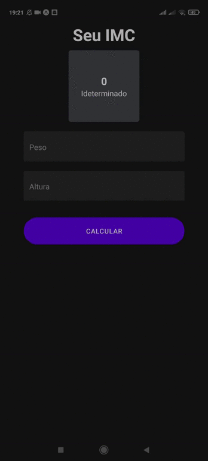

<h1 align="center">

</h1>
<h3 align="center">
	Expo-BMI-calculation
</h3>

<p align="center">
	
	
</p>

<p align="center">
	
</p>

## Overview
<p>
    📱 Simples App de calculo de imc construído em React Native utilizando a ferramenta Expo
</p>


## Installation and usage


Certifique-se de ter instalado todas as dependências e aplicativos para executar o projeto React Native atraves do : [Expo](https://docs.expo.io/).

### Running the project

Clone este repositório:

```
git clone https://github.com/LeonardoSCarvalho/expo-BMI-calculation.git
cd expo-BMI-calculation
```

Install packages :

```
yarn install
```


Certifique-se de ter instalado todas as dependências e aplicativos para executar o projeto React Native em seu computador:

```bash
yarn start

```

## :memo: Licença

Esse projeto está sob a licença MIT. Veja o arquivo [LICENSE](../LICENSE) para mais detalhes.